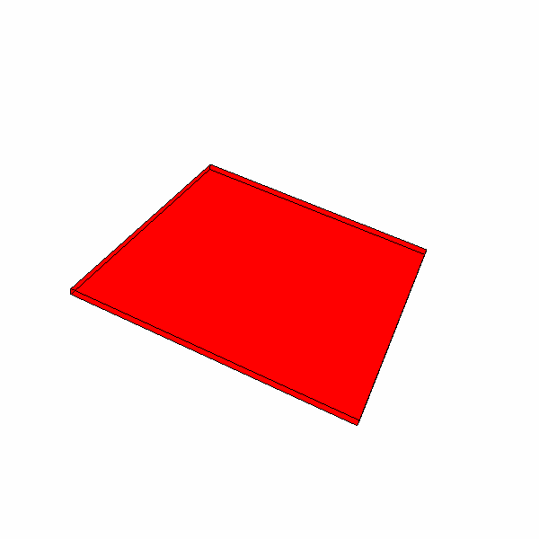
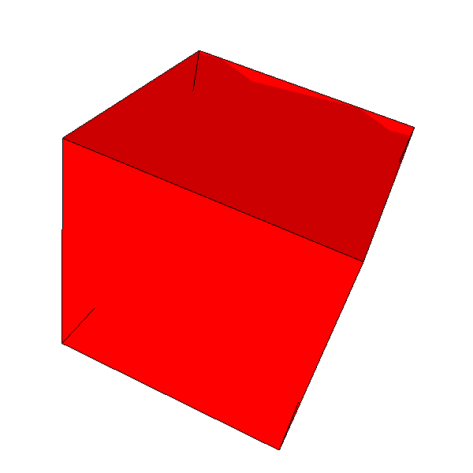
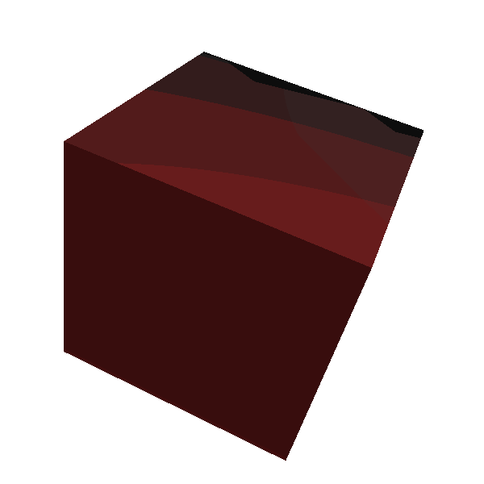
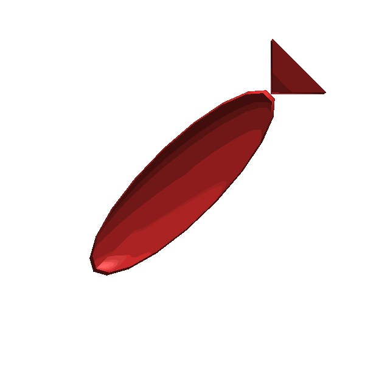

# Graphics Sandbox

This repository contains different experiments with 3D graphics. 

All experiments are done using **VisPy**.

## Installation

To set up the environment, create a Conda environment from the provided `environment.yml` file:

```bash
conda env create -f environment.yml
conda activate graphics-sandbox
```

## Showcase

### Rotating Plane



### Rotating Cube



### Rotating Cube Mesh



### Rotating Fish Mesh


